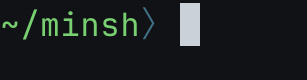

# minsh - Minimal (Working) Shell written in Rust



# Introduction
`minsh` (a.k.a **Min**imal **Sh**ell) is a minimal shell that written in Rust. This is my `built-your-own-X` project to learn what a shell is and how to make a usable shell.


# Usage
To run `minsh`, you can compile the code using `cargo`
```
cargo run --release
```
After compilation, you will directly get into `minsh`.

# Functionalities
Currently `minsh` supports minimal features like
- Syntax Highlighting
- Suggestion
- History
- Tab Completion

These features are empowered by [`reedline`](https://github.com/nushell/reedline), which is used in `Nushell`, a performant shell written in Rust.

# References
- [Build Your Own Shell using Rust](https://www.joshmcguigan.com/blog/build-your-own-shell-rust/)
- [reedline](https://github.com/nushell/reedline)
- [NuShekk](https://github.com/nushell/nushell)
